# OneKeyboardを作る

DigiSparkを使うことで、USB接続のHID(Human Interface Device)を簡単に作成できます。100均のプッシュライトを改造して、キーひとつだけのキーボードデバイスを作ってみます。
なぜHIDか? 古き良き企業では、ソフトウェアやデバイスドライバをインストールするのに管理者の許可が必要であり、ドライバ不要のHIDになれるのはとても大きなメリットなのです。

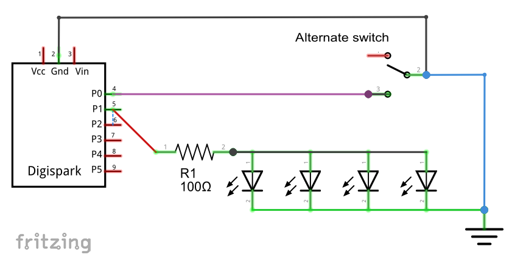

## 開発環境の準備

### Arduino IDE のインストール

### Digisparkライブラリを組み込む

## ソフトウェア

1. Arduino IDE by DigiStomp
2. [スケッチ](prtScrnKey.ino)

#### オルタネートキー対応

ダイソータッチライトに内蔵されているスイッチは、押すごとにオンとオフが切り替わる、オルタネートタイプのスイッチなので、「現在から状態が変化したら」という条件で発火するようにした。判定処理はシンプルにかけた。

もし押したそのときだけオンになるモーメンタリタイプのスイッチを使う場合は、オンで発火したあとにオフになったことをもって次の判定に入る、ただしそのオンやオフはチャタリングではなく意図した操作である、といった処理を書かなくてはいけない。

#### SendKey関数

DigiKeyboard.SendKeyStroke だと指定したキーのあとに必ずキーオフのシーケンスを送出しているため、Alt+PrtSc だけを送出すると Windowsアプリでメニューを選択した状態が残ってしまう、という不具合があった。

そこで、SendKeyStroke からキーオフ送出部分を取り除いた関数を用意して、 Alt+ArtSc, Altのみ、キーオフ、という3段階で送出してみたところ、意図通りの機能となった。 Windowsに対してAltを併用するシーケンスを送出する場合の常套句なのではないだろうか。

## ハードウェア

### 今日の材料

1. [Digispark USB Development Board](http://digistump.com/products/1) (Clone; $2.29 @ eBay)
2. [ダイソー プッシュライト4LED](photo/0_pushlight.JPG) (&yen;108 @ daiso)
3. ダイソー MicroUSBケーブル (&yen;108 @ daiso)
4. 配線材を少々 (要らないLANケーブルをばらした)

### 工具リスト

1. ~~精密ドライバー +0 (ダイソーで6本入りのやつ)~~
2. グルーガン (ダイソー)　と　グルースティック　(ダイソー)
3. はんだごて　(ダイソー)　と　はんだ　(ダイソー)
4. ニッパ　(ダイソー)
5. バイス　(ダイソー)
6. やすり　(ダイソー)
7. 作業台　(壊れたテレビ台の天板を流用)
8. パイプ椅子　(ダイソー)

### 工作のようす

今日の材料であるダイソーのプッシュライト。単4電池3本でLEDを光らせるもの。裏側にはマグネットもついていておあつらえむきである。透明パーツの左側が支点となって、右端のスイッチを押し込むという構造。スイッチは押すとON、もう一回押すとOFFとなる、「オルタネート」タイプ。
ピンクの枠はカパッとはめてあるだけなので、手で引っ張るだけで簡単に外せる。透明のフタと銀色の板を外すだけで回路にたどりつける。

 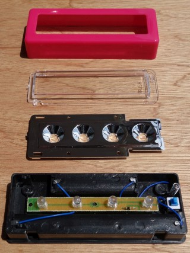

LED基板も載せてあるだけなので、外しておく。青いワイヤは、バネの近くの一つはそのまま再利用するが、それ以外は外しておく。電池ケースの金属板は使わないので捨ててしまっていい。

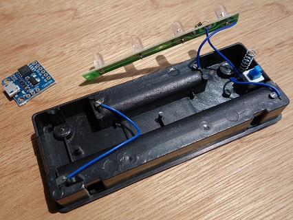

電池ケースの空きスペースにDigisparkがすっぽり収まる。邪魔になる黒い突起をひとつ、細い部分をニッパでちぎっておく。

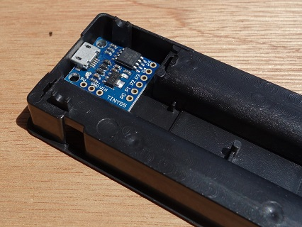

今回は裏返しにすることにした。完成イメージ、こんな感じかな。

USBコネクタにあたる部分の黒い枠を、ニッパでちぎりとる。

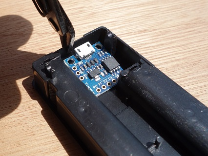

ちょっと切りすぎたけど気にしない。

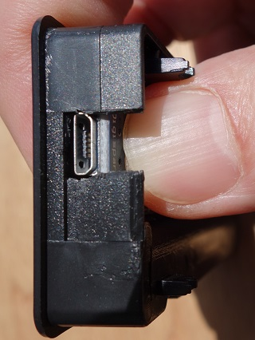

上からみると、これぐらい引っ込んでる。しかし、あつらえたようだ。

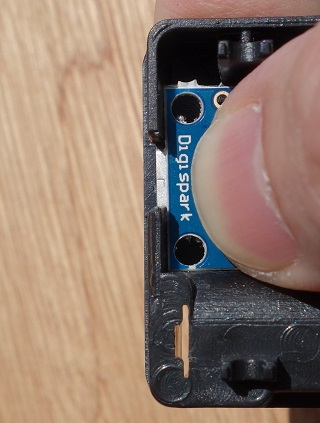

次はピンクの外枠を加工する。太陽に透かして見て、このへんかなあとあたりをつけて……

ピンバイスでゴリゴリと穴をあける。手回しなので、ちょっと根気がいる。

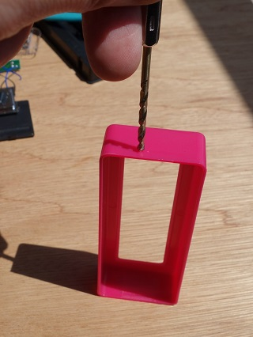

二つあけた。ずれてるけど気にしない。

やすりを使って二つの穴をつなげて、MicroUSBコネクタが刺さるような穴にする。これもちょっと根気がいる。

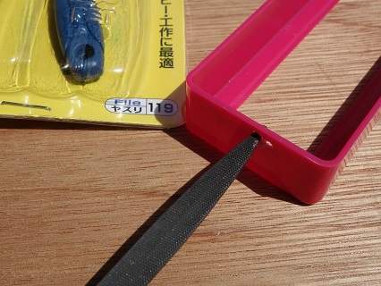

どうせコネクタで隠れるので、ちょっとくらいみっともなくても気にしない。

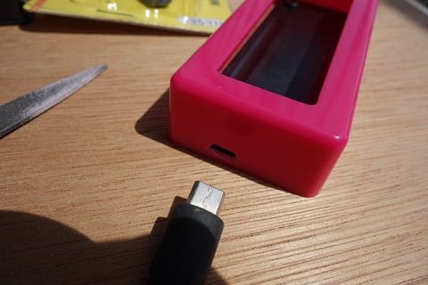

配線はこんなかんじで。
青い線は元のやつを再利用して、黒い線とねじり合わせてからスイッチの真ん中へ。黒い線の反対側は基板の下を通って左側のGNDへ。スイッチの端っこは赤い線でP0へ。基板の抵抗の足、もともと青い線がついてたところからP1へそれぞれはんだ付けする。

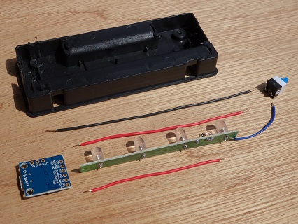　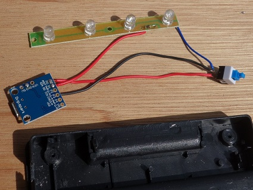

仮組みしてみて動作確認する。PCにつないでみて、2秒くらいしたらぴかあぁっと光って、押したらぴかぁ、もう一回押したらぴかぁとなればOK。

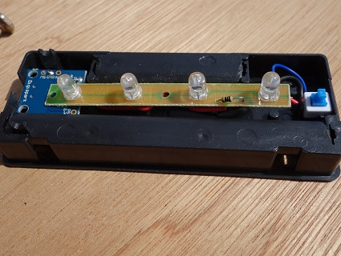

さて仕上げよう。グルーガンにグルースティックをセットしてあっためて……

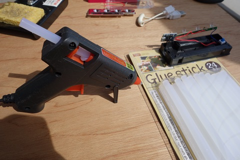

現物合わせにするので、ピンクのフタ側でUSBケーブルを刺して位置決めをした状態で……

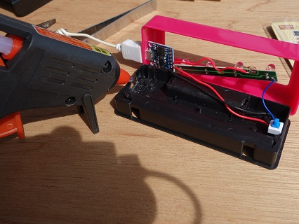

グルーをぶちゅぶちゅっと出して、冷めないうちにピンクのフタごとカパッとはめて、ちょっと冷めて固まったころに様子を見てみる。この写真はちょっとはみ出しちゃってる。ぺりっとはがして2回くらいやり直した。

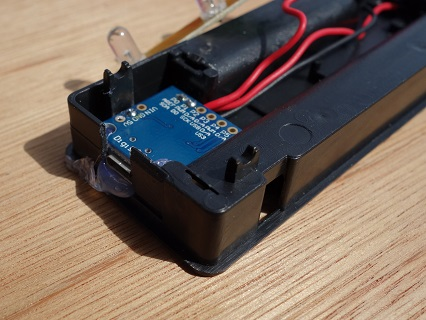

位置が決まったら、奥のカドのP0の近くあたりにも、グルーをぶちゅっとして固定しておく。

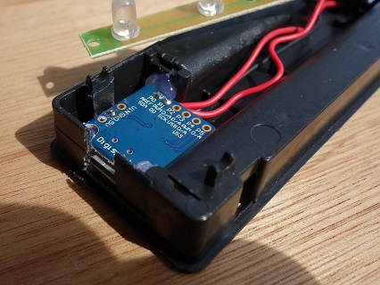

逆の手順で組み立てる。この写真には載ってないけれど、Digisparkの基板とLEDの基板が重なるところでショートしちゃうので、名刺くらいの紙を小さく切って2枚くらい挟む必要があった。

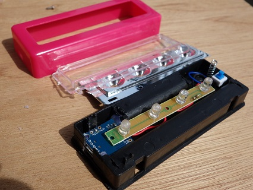

ピンクのフタをカパッとはめれば完成。

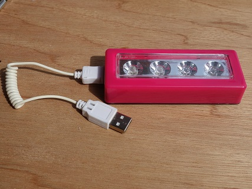
